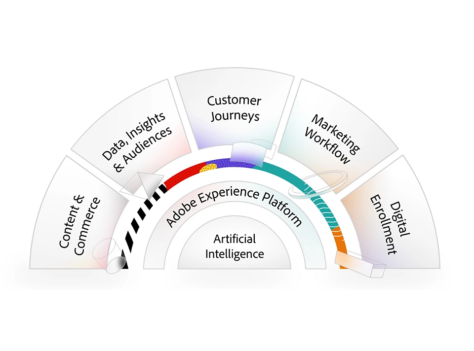

<TitleBlock slots="heading, text" theme="light" />

### Experience Cloud Essentials Course

This course provides an in-depth view into the how the Adobe Experience Cloud has been architected to help companies manage and deliver best in class marketing experience's through Adobe's digital marketing suite.

<TextBlock slots="image, heading, text1, text2, text3" />

### What You Will Learn

The Adobe Experience Cloud is what powers the backbone of the Adobe suite of the digital marketing tools. Understanding how it works will help you better manage and make strategic decisions around how you setup and deploy your marketing teams for success. 

In this course you will dive into the following areas of the Adobe Experience Cloud: 

- Security and Privacy - how Adobe deploys, secures and provides mechanisms for companies to honor and enforce customer privacy
- Experience Cloud ID (ECID) - an overview of what the ECID is, why it matters and how its used to help power digital experiences across web and mobile
- User Access Control - how companies can administrate and manage their licenses within any of the Adobe Cloud product offerings

<AnnouncementBlock slots="heading, button" />

### Take the Course

[Launch](/training/aec-essentials/index.html)