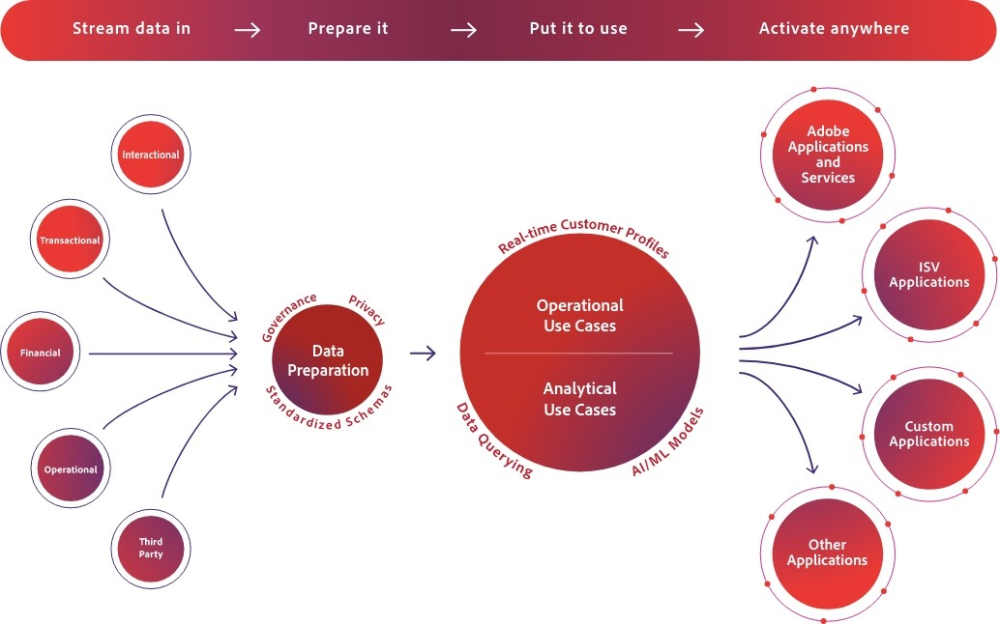

<TitleBlock slots="heading, text" theme="light" />

### Experience Platform Essentials Course

This course provides an architectural overview of the Adobe Experience Platform and how it is built to both centralize the marketing operations and deliver real-time personalization at scale 

<TextBlock slots="image, heading, text1, text2, text3" />

### What You Will Learn

Go deep into the inner workings of the Adobe Experience Platform from both a business and architectural lens.  You will understand the problem we were trying to solve by building the Experience Platform as well as how it is built so that you can appropriately design, build and leverage all the capabilities it offers to deliver next-gen marketing experiences.

In this course you will dive into the following areas of the Adobe Experience Platform: 

- Understand the history behind the Adobe Experience Platform: why it was built and what problems it solves for both IT & marketing teams
- Know at an architectural level the core components of the Experience Platform and how they were designed to ultimately support real-time marketing experiences
- Be able to think through the various architectural considerations when it comes to deployment and setup of the Experience Platform and the supporting applications / services around it

<AnnouncementBlock slots="heading, button" />

### Take the Course

[Launch](/training/aec-essentials/index.html)