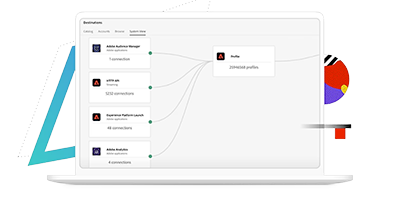

<!-- Title -->
<Hero slots="image, heading, text" background="rgb(64, 34, 138)" hideBreadcrumbNav={true}/>

# Courses

Start your learning adventure for the Experience Platform via digital or in-person bootcamps

<!-- Digital Course -->
<TitleBlock slots="heading" theme="light" />

### Digital Courses

<ProductCard slots="icon, heading, text, buttons" theme="light" width="33%" />

#### Experience Cloud Essentials

The Adobe Experience Cloud is what powers the backbone of the Adobe suite of the digital marketing tools. Understanding how it works will help you better manage and make strategic decisions around how you setup and deploy your marketing teams for success.

* [Start Learning](/courses/aec-essentials/index.html)

<ProductCard slots="icon, heading, text, buttons" theme="light" width="33%" />

#### Experience Platform Essentials

Go deep into the inner workings of the Adobe Experience Platform from an architectural lens to better understand how it is built so that you can appropriately design, build and leverage all the capabilities it offers to deliver next-gen marketing experiences.

* [Coming Soon!](index.md)

<!--
* [Start Learning](/courses/experience-platform-essentials/)
-->

<ProductCard slots="icon, heading, text, buttons" theme="light" width="33%" />

#### Platform Deployment Architecture

Have you ever wondered how to deploy the Experience Platform from a geographical standpoint? Well learn about your options as well as a simple methodology for determining how best to deploy for your organization structure.

* [Coming Soon!](index.md)

<!--
* [Start Learning](/courses/experience-platform-technical-foundation/)  
-->

 
 
 
 
<TextBlock slots="image, heading, text1, buttons" />

# In-Person Bootcamps

App Builder is a cohesive set of tools and services that enable developers to extend and integrate Adobe solutions, starting with Adobe Experience Manager, all in one package.​ With a complete extensibility framework, built on Adobe's infrastructure, App Builder enables developers to extend and integrate Adobe solutions with ease.

<!-- Bootcamps -->
<TitleBlock slots="heading" theme="light" />

### In-Person Bootcamps

<ProductCard slots="icon, heading, text, buttons" theme="light" width="33%" />

#### Experience Platform Foundations

Go deep into the inner workings of the Adobe Experience Platform from an architectural lens to better understand how it is built so that you can appropriately design, build and leverage all the capabilities it offers to deliver next-gen marketing experiences.

* [Coming Soon!](index.md)

<ProductCard slots="icon, heading, text, buttons" theme="light" width="33%" />

#### Journey Optimizer Foundations

Gain a deeper understanding of how Adobe Journey Optimizer is architected to deliver real-time 1:1 cross channel customer experiences. Having attended the Experience Platform Foundations bootcamp is a pre-requisite for attending this course.

* [Coming Soon!](index.md)

<!--
* [Start Learning](/courses/experience-platform-essentials/)
-->

<ProductCard slots="icon, heading, text, buttons" theme="light" width="33%" />

#### Customer Journey Analytics

Learn about how Customer Journey Analytics can be used to power insights and analysis for your marketing teams through the use of cross-channel reporting natively built and integrated with the Experience Platform Foundation. Having attended the Experience Platform Foundations bootcamp is a pre-requisite for attending this course.

* [Coming Soon!](index.md)

<!--
* [Start Learning](/courses/experience-platform-technical-foundation/)  
-->

<!-- Call to Action - To register for the course 

<AnnouncementBlock slots="heading, text, button" theme="dark" />

### Join our waiting list here!

Sign up for the opportunity to attend in person Adobe Experience Platform Essentials

[Register Now](#)-->
