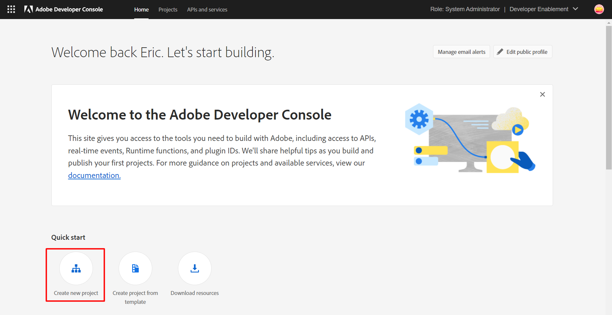
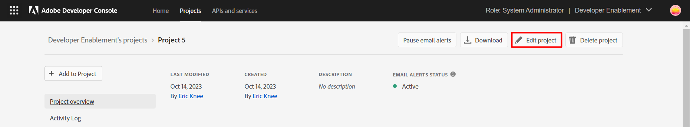
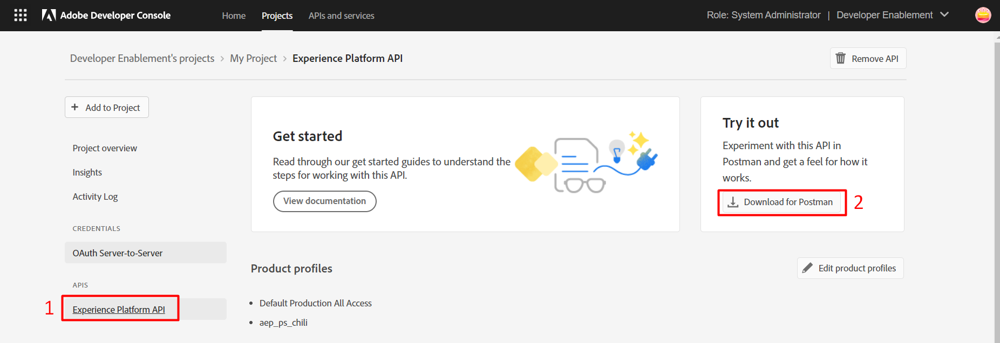

## Access Adobe Developer Console

1. Open a browser window and navigate to the following url:   https://developer.adobe.com
2. Login with your existing Adobe ID `<email>/<password>`

<InlineAlert variant="warning" slots="text" />

In order to use Experience Cloud product API's and subscribe to events your company administrator must assign you the necessary product permissions and developer rights via the Adobe Admin Console. Please re-visit the [Getting Started](../getting-started/index.md) page and review the Dependencies if you wish to learn more.

## Create a project

Once logged in click the `Create New Project` button in the top right corner of the browser and select `Empty Project`

Rename your project by clicking the `Edit Project` button at the top right of the browser.

Add a name and click `Save`  

## Add APIs to your project

Next you need to add an API to the project. Click the `Add to Project` button in the top left of the browser  

Filter the list of API's by the product you wish to interface with. In this guide we'll specifically select the `Adobe Experience Platform` product and then select the `Experience Platform API`. Click `Next` in the lower right of the screen 

## Setup your Key Pair

You now need to provide an ssh key. Adobe gives you two options: `Generate a key pair` or `Upload your public key`. Choose the first option `Generate a key pair` and then click the button `Generate Keypair` in the lower right of the browser. 

This will immediately download a `config.zip` file to your local machine that contains both both the private and public key for your Adobe I/O project. 

<InlineAlert variant="warning" slots="text" />

Save this to a safe place before proceeding

## Assign your Project to a Product Profile

Next you will need to choose a product profile to assign the Adobe I/O project to. After selecting a product profile click the button `Save configured API` in the lower right of your browser  

<InlineAlert variant="help" slots="text" />

Your screen will look different here based on your organizations licensed products so select the appropriate product profile. If you aren't sure which one to select please reach out to your company's Adobe administrator.

When done your screen should look like the below

 
 
 

<SummaryBlock slots="image, heading, text, buttons" />

## Congratulations!

Awesome sauce! You have now setup your 1st Adobe Developer project with access to the Experience Platform APIs (or any product API's you may have selected). If you want to learn how to utilize the APIs check out the next guide where we will show you how to do so with a 3rd Party tool you may have heard of called Postman :)

- [Setup Postman](../postman/getting-started/index.md)

 
 
 

## Optional step - Download a pre-populated Postman environment

<InlineAlert variant="info" slots="text" />

This is a completely optional step. In the [Working with Postman](../../postman/getting-started/) guide you will also see how to manually create your own environment within Postman.

Once your project is setup you will likely want to work with the APIs. Postman is a tool that many of our other guides will reference when working with the Experience Platform APIs. To help make the experience seamless we auto generate a Postman environment file for you based off of the Developer project you created.  If you would like to download it open the project and be sure you have select the `Experience Platform API` integration. You should then see an option in the upper right corner of the screen to `Download for Postman`. Clicking that should should immediately trigger a file download to your local machine named `service.postman_environment.json`.  Note its location as you you can leverage it in the [Working with Postman](../../postman/getting-started/) guide.

