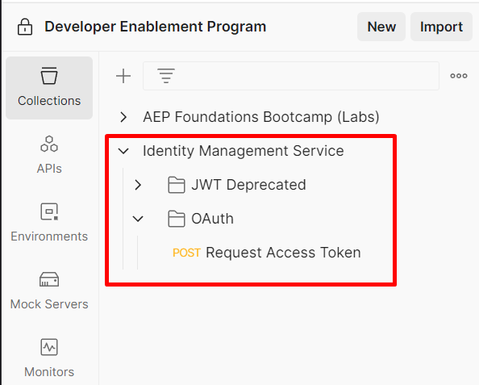
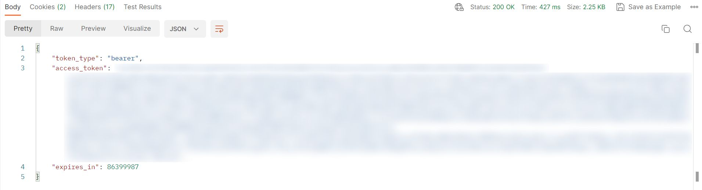

## API Security Overview

To establish a secure API connection to an Adobe product Adobe provides two different server-to-server credential methods that you can use

<br/>

- OAuth Server-to-Server credential
- Service Account (JWT) credential (deprecated)

<InlineAlert variant="warning" slots="text" />

The Service Account (JWT) credentials have been deprecated in favor of the OAuth Server-to-Server credentials. Your applications using the Service Account (JWT) credentials will stop working after Jan 1, 2025. You must migrate to the new credential by Jan 1, 2025, to ensure your application continues functioning. [Learn more](https://developer.adobe.com/developer-console/docs/guides/authentication/ServerToServerAuthentication/migration/).

Regardless of the type of credential you choose Adobe requires you to create a developer project first within the Adobe Developer Console.  In order to have access to the Developer Console you must have been assigned Developer Rights within the Adobe Admin Console. Once you have these rights you can create developer projects utilizing the various Adobe product related APIs. This is where the OAuth Server-to-Server credential comes into play. To generate an access token you must pass a certain set of claims to Adobe's Identity Management Service (IMS).  For OAuth server-to-server credentials an example call would like so:

```curl
curl -X POST 'https://ims-na1.adobelogin.com/ims/token/v3?client_id={CLIENT_ID}' \
  -H 'Content-Type: application/x-www-form-urlencoded' \
  -d 'client_secret={CLIENT_SECRET}&grant_type=client_credentials&scope={SCOPE} 
```

<InlineAlert variant="help" slots="text" />

You can learn more about the e2e process for creating the developer project using OAuth Server-to-Server credentials [here](https://developer.adobe.com/developer-console/docs/guides/authentication/ServerToServerAuthentication/implementation/#generate-access-tokens)


## Why the Move to OAuth?

The new OAuth Server-to-Server credentials rely on the OAuth 2.0 client credentials grant. Therefore, you can use industry-standard [OAuth 2.0 libraries](https://developer.adobe.com/developer-console/docs/guides/authentication/ServerToServerAuthentication/implementation/#generating-access-tokens-using-standard-oauth2-libraries) to implement access token generation in your application. Unlike the Service Account (JWT) credential, the new credential does not use a public certificate and private key pair to generate access tokens. As an application developer, you do not have to periodically rotate the public certificates and private key pairs when they expire. Also, the credential setup process is greatly simplified, and you do not have to download and save the private key on your machine. Lastly, while the new OAuth Server-to-Server credentials do not use expiring certificates, they still allow client secret rotation through the UI and API. Read more about rotating secrets programmatically in our guide on [rotating client secrets](https://developer.adobe.com/developer-console/docs/guides/authentication/ServerToServerAuthentication/implementation/#rotating-client-secrets-programmatically).

<br/>
<br/>

<b>Quick comparison of OAuth vs. JWT</b>

|     | OAuth Credential | JWT Credential |
| --- | --- | --- |
| Do expiring certificates need to be replaced every year? | This credential does not use public certificates or private key pairs. You are not forced to rotate certificates every year. | You need to rotate the public certificate and private key pair every year. |
| Generating access tokens for experimentation | You can generate an access token for quick experimentation with a [one-click button](https://developer.adobe.com/developer-console/docs/guides/authentication/ServerToServerAuthentication/implementation/#generate-access-tokens) on the Developer Console. | Generating access tokens is a 3-step process spanning Developer Console UI and your command-line terminal. |
| Generating access tokens in your application | You can use standard [OAuth 2.0 libraries](https://developer.adobe.com/developer-console/docs/guides/authentication/ServerToServerAuthentication/implementation/#generating-access-tokens-using-standard-oauth2-libraries) to generate access tokens in your application programmatically. | You can implement access token generation programmatically by reading our documentation. |
| Rotating client secrets programmatically | You can rotate client secrets on-demand through the Dev Console UI and API. [Learn more](https://developer.adobe.com/developer-console/docs/guides/authentication/ServerToServerAuthentication/implementation/#rotating-client-secrets-programmatically) | You can rotate the public certificate and private key pair manually through the UI. |


## Adobe Experience Platform + Adobe IMS

Every request to any Adobe service must include the access token in the Authorization header along with the Client Secret that was generated during the developer project creation.  Additionally, the Experience Platform and its associated applications require two other header params are present on each request.

<br/>

- **x-gw-ims-org-id** - this param specifies the IMS Org that the request belongs to and ensures the processing of the requests resolves to the appropriate SaaS environment
- **x-sandbox-name** - this param specifics which sandbox to process the request in within the Experience Platform

Now that you understand a little bit about how Adobe secures its API's and what is required to work them lets actually use them.

<InlineAlert variant="warning" slots="text" />

Not specifying the x-sandbox-name param does not fail the request as you might expect. Instead it defaults the request to process into the default sandbox that is automatically provisioned with any Experience Platform environment

## Get the Identity Management Service Collection

Open the Postman API Collection File from above in your browser by clicking on the file
Copy the URL of the file to your clipboard
Launch Postman on your local machine and click on the Import button within your workspace
Paste the URL of the Postman API Collection File into the import modal text box on the overlay.  This should trigger an automatic import

1. Navigate to the Experience Platform Postman Samples Github repository to get the Identity Management Service Postman collection located [here](https://github.com/adobe/experience-platform-postman-samples/blob/master/apis/ims/Identity%20Management%20Service.postman_collection.json)

2. Click on the `raw` icon in Github to open a new window displaying just contents of the file. Copy this URL to your clipboard

    

3. Launch Postman on your local machine and click on the Import button within your workspace

4. Paste the URL of the Postman API Collection File into the import modal text box on the overlay.  This should trigger an automatic import

    <div style="margin:20px 0 0 20px;">
    <div style="display:inline-block; width:50%;"></div>
    <div style="display:inline-block; vertical-align:top; width:50%;"></div>
    </div>

<br/>

4. You should now see the collection in your Postman application. You can view it by simply selecting `Collections` in the sidebar and then clicking into the single request contained within the collection.

    

## Generate your Access Token

Its time to test out your Postman setup to see if you can access the Experience Platform APIs via your developer project. Before you can go firing of your first call though we need to select the environment that Postman will use.

1. Launch Postman and navigate to the directory titled IMS Authenticate and open the `OAuth` folder and click on the request titled `Generate Access Token`
2. Next in the upper right corner of Postman you'll see an environment drop-down. Select your environment from the drop-down
3. Now execute the call by clicking the “Send” button

    

4. Navigate back to sidebar and select 'Collections' and then select the only call in the 'Identity Management Service' folder. Open the call and double check that variables in the 'Body' are populated.  If all is good then its time to make magic happen. Click `Send`.

    

<br/>

The response from the request to Adobe's IMS will always respond with the following upon a successful call. If you see this awesome sauce!

#### Success

```json
{
    "token_type": "bearer",
    "access_token": "<value>",
    "expires_in": 86399979
}
```

- **token_type** - always will be of type bearer
- **access_token** - proves authorization and required in the authorization header of all API calls
- **expires_in** - milliseconds until the access token expires (24hrs expiration period today)

<InlineAlert variant="success" slots="text" />

Congratulations!  You've successfully authenticated and your access_token is now saved to your environment file