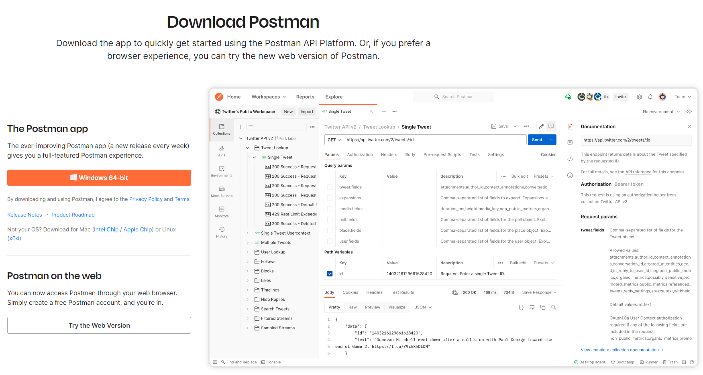
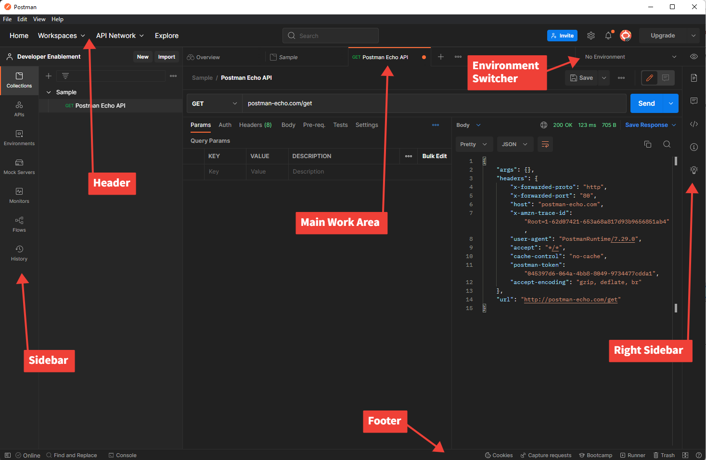

## Install Postman

Navigate to the Postman website and install the application...https://www.postman.com/download/

## Launch the application

Open the Postman application and familiarize yourself with a few areas of the application. For the purposes of working Experience Platform we really only need to focus on a few key areas of the application.

 

- Sidebar
  - Collections
  - Environments
- Header
  - Workspaces
- Main work area
  - Right sidebar
  - Environment selector
- Footer

### Sidebar

The sidebar is what allows you to navigate quickly across the different Postman elements. In Experience Platform you will predominately only use the two mentioned below. You can learn more at the following

Collections - groups of saved requests that can be imported from an external location or created by yourself.

Environments - a set of variables that you can reference in your Postman requests. In Experience Platform you can think of Postman Environments as synonymous with Adobe IMS Orgs. We will use the Environment's function in Postman

### Header

Workspaces - enable you to organize your work for both personal use and with a broader team

### Main work area

The main work area is where you will perform a majority of your work when working in Postman. All API requests are exposed in a specific tab within the main work area.

Right sidebar - provides additional access to tools based on the current tab selected. Examples are documentation for the request, comments and code snippets to name a few features.

Environment selector - allows you to quickly switch between different environments to access pre-configured variables when working APIs. When working with Experience Platform you will leverage this when working in a specific Adobe IMS Org.

### Footer

At the very bottom of the Postman application you will find a set of functions that allow you to quickly see and toggle features on/off.

## Learn More about Postman

If you are interested in learning more about Postman look at the Postman [Getting Started](https://learning.postman.com/docs/getting-started/introduction/) documentation.