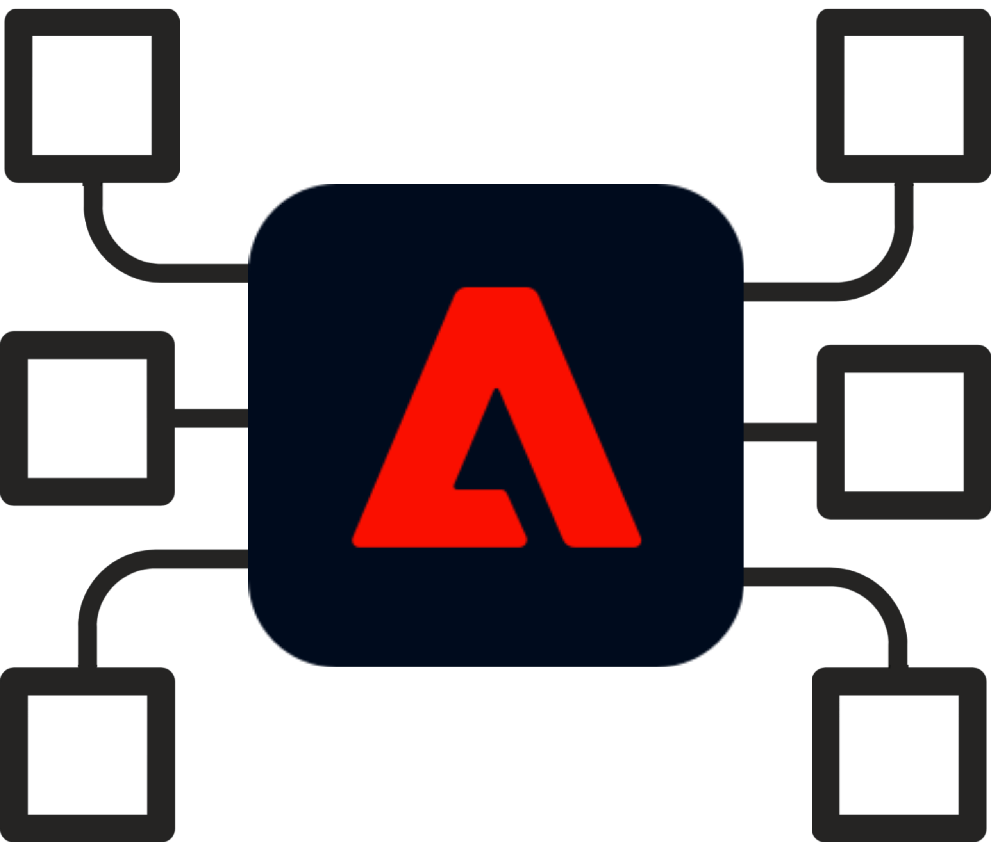

<Hero slots="heading, text" variant="fullwidth"/> 

# Developer Experience for Experience Platform

Educating and enabling developers and architects on the "_why_" behind the "_how_" with Experience Platform

<TitleBlock slots="heading, text" theme="light" />

### Enablement Courses

The Adobe Experience Platform powers a wide breadth of the Experience Cloud applications by offering a centralized brain for data, customer profiles and segmentation. In order to understand how to best utilize the Experience Platform developers and architects must understand the underlying components and how best operationalize these within their martech stacks.

<TextBlock slots="image, heading, text, links" width="33%" />

### Experience Cloud Essentials

Go in depth to learn about how the Adobe Experience Cloud is architected

* [Learn More](/courses/experience-cloud-essentials/)

<TextBlock slots="image, heading, text, links" width="33%" />

### Experience Platform Essentials

Go in depth to learn about how the Adobe Experience Platform is architected

* [Learn More](/courses/experience-platform-essentials/)

<TextBlock slots="image, heading, text, links" width="33%" />

### Experience Platform Technical Foundation

A comprehensive course that covers all aspects of the Experience Platform at an architectural level. Purpose built for developers and architects who want deep technical training and knowledge.

* [Learn More](/courses/experience-platform-technical-foundation/)  
