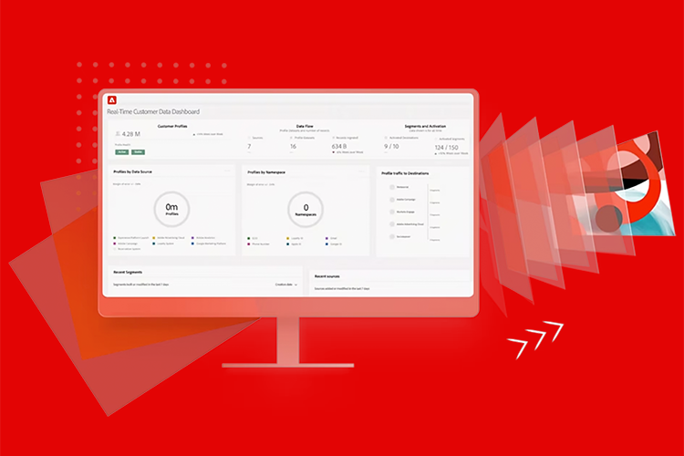

import '../styles/main.css'

<!-- Hero Banner -->
<Hero slots="image, icon, heading, text2, buttons" variant="halfwidth" />

# Developer Experience starts here!

Educating and enabling developers, architects, and engineers on the "_why_" behind the "_how_"

* [Get started](/courses/)
<!-- * [Register to get your seat](https://adobe.io) -->

<!-- Call to Action - To register for the course 

<AnnouncementBlock slots="heading, text, button" theme="dark"/>

### Join our waiting list here!

Sign up for the opportunity to attend in person Adobe Experience Platform Essentials

[Register Now](#) -->

<!-- Training Course Block -->

<TextBlock slots="image, heading, text1, buttons" />

# Training Courses

Comprehensive courses that teach the "why" behind the "how" and prepare you for the Adobe Experience Platform certification. This tutorial is the perfect starting point for Data Engineers, Data Analysts, Data Architects, Data Scientists, Orchestration Engineers and Marketers to gain a full understanding of the business value of Adobe Experience Platform and all of its application services

* [Get started](/courses)

<!-- Digital Expereince Blueprint Block -->
<TextBlock slots="image, heading, text1, text2, buttons" theme="dark"/>

# Digital Experience Bluerpints

Quickly solve established business problems.

Digital Experience Blueprints are repeatable implementations that let you address strategy and quickly solve established business problems. Each Blueprint provides a series of artifacts that explain the high-value business problem, architectures, implementation steps, technical considerations, and links to the relevant documentation.

* [Learn More](https://experienceleague.adobe.com/docs/blueprints-learn/architecture/overview.html?lang=en)

<!-- Marketing Video Block -->
<TextBlock slots="video, heading, text" theme="light" />

[Creative Cloud for a new era](https://youtu.be/gFGgA0uvN9U)

### Why Development Enablement Program?

The Adobe Experience Cloud (AEC) powers a wide breadth of Adobe applications that assist in the creation, delivery and personalization of content.  Underneath many of these applications sits the central marketing brain in the Adobe Experience Platform where data collection, customer profiles and segmentation starts within Adobe's CDP.

<!-- Shortcut links Block -->
<TextBlock slots="image, heading, text, links" width="33%" />

### Training Courses

Comprehensive courses that teach the "_why_" behind the "_how_" and prepare you for certification

* [Learn More](/courses/)

<TextBlock slots="image, heading, text, links" width="33%" />

### Developer Guides

Guides built for the developer that help you learn to leverage the APIs to build with the Experience Platform

* [Learn More](/guides/)

<TextBlock slots="image, heading, text, links" width="33%" />

### Experience Blueprints

Collection of various system and application blueprints to help guide architecture

* [Learn More](https://experienceleague.adobe.com/docs/blueprints-learn/architecture/overview.html?lang=en)

